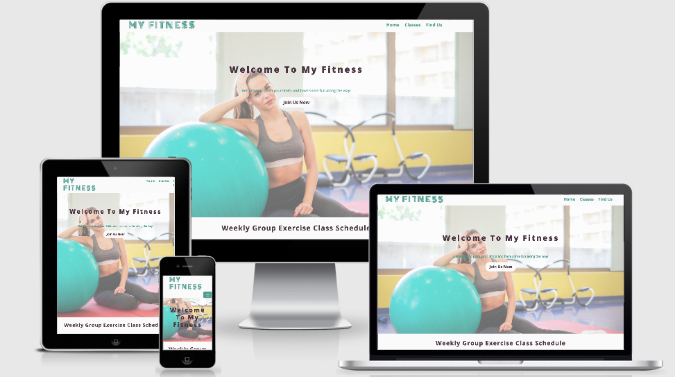

# **My Fitness:**

My Fitness is website designed to brand "my fitness gym" and attract new clients by presenting the services the gym provides with links on how to join the gym, classes schdeule and other users reviews, the website designed as one pages with navigation menu bar follows you while scrolling the website to provide you with the information you require easily. 
the design is responsive and it will work on any desktop laptops tablets and mobile devices.

# **UX** 

**as a user:**
- Ability to join the gym by filling a form.
- Ability to find the weekly classes schedule.
- Ability to check other users reviews.
- Ability to navigate thru google maps to find the gym locationa.
- Ability to find the gym contact details.

**as website owner:**
- Provide the users with all weekly classes schedule.
- Provide the users with other users reviews.
- Provide the users with contact details.
- Provide the users with responsive google map tool to navigate easily the surrounding area of the gym.

## **Wireframes**:
The wireframes designed by Balsamiq tool, [link to wireframes!](wireframes/wireframes.pdf)

# Features:
## Existing Features:
- Navigation menu bar that linked to different sections in the  website.
- The menu bar will switch to a button that collapse in the mobile version.
- Sticky menu bar with the logo while surfing the whole page.
- Join us botton in the middle of the main page that linked to a form.
- The weekly classes schedule table with responsive design it can be scrolled horizontally when there is no enough space on the screen.
- The links color in menu navegation bar change when hover or click.
- Clickable logo that reload the page.
- Reviews of happy users with a photo beside it.
- Location of the gym on google maps, users can naviagte to check the gym location  or maybe drive to.
- Form that includes all the personal details of users plus their messages, the "send now" button will reload the page.
- Footer that links to all social media channels.

## Futute Features:
- Functiong form that send the user details to a back end system with auto reply (confirmation email).

# Technology Used:
## Front-End Languages: 
HTML5, CSS3
## Frameworks:
### Bootstrap:
- The responsive griding design.
- The join us botton.
- Collapse button for menu bar in mobile version.
### Balsamiq:
Designed the wireframes.
### VSCode:
This whole project code written using VScode.
### Fontawesome:
Used the icons in the footer.
### Github:
The whole project commited and pushed to github repository and published on Github pages.
### Java Scrip:
Google maps.

# Testing:
 ## Nav bar 
 - Click on home link to reload the page.
 - Click on classes link to the weekly classes timetable.
 - Click on find us link to the Find Us section.
 - The links color changes when hover or clicked on t yellow.
 - Click on the button in the mobile version then will collapse and show the menu bar links.
 - The header and menu bar is sticky, will stay on the top while surfing the website.
 ## hero image
 - Click on join us link to the send us a message form.
 ## logo
 - Click on logo to reload the page.
 ## google maps
 - Ablitiy to move arround the location.
 ## Form
 - Fill all the fields and click on Send now! button and the page will reload.
 - Cant enter letters in the Phone Number field. 
 - Missing any of the fields information will return with "please fill in this field".
 ## Footer
 - Click on facebook icon and will direct you to facebook website in a new tab.
 - Click on twitter icon and will direct you to twitter website in a new tab. 
 - Click on instagram icon and will direct you to instagram website in a new tab. 
 - Click on twitter icon and will direct you to twitter website in a new tab.
 ## HTML5 and CSS3 W3 school validation
 The HTML and CSS code both validate it by the w3 schools.
 ## Responsive
 The design was tested on the following devices:
 Desktop
 Laptop
 Iphone 6/7/8
 Galaxy Fold
 Iphone 5/SE
 Galaxy S5
 Pixel 2
 Pixel 2 XL
 Iphone 6/7/8 plus
 Iphone X
 IPad pro
 Surface Duo
 
 # Deployment
 The site was deployed to GitHub pages by following the below steps: 
 Log in to the repository - https://github.com/besheraj/milestone1
 Click Settings
 Scroll down to GitHub Pages
 Set Source to Branch:master
 Click Save

 # Credits
 ## Images
 All images downloaded from https://www.pexels.com/
 ## Code
 - Contact us:
 The code straucture used in the online cv project by code institute.
 - Hero image css style:
 Used the opacity css trick from https://codepen.io/ncerminara/pen/eFzJI/
 ## Contect
 All content i created myself
 ## Icons
 By Fontawesome
 ## Map
 By Google.
 ## table 
 By bootstrap 

 

